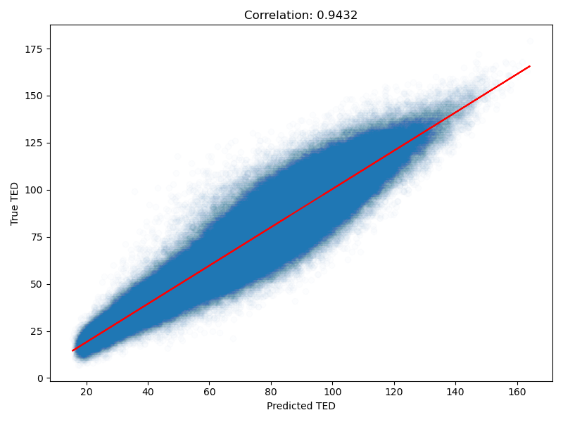

# predTED

Fast approximate prediction of pairwise **Tree Edit Distances (TED)** for RNA secondary structures in dot-bracket notation. Uses 144 structural features with a LightGBM regression model to avoid the expensive exact O(n^4) computation.

**Up to 100x faster** than `RNAdistance` for pairwise distance matrices, making it practical as a prefilter for large-scale RNA structure comparisons.

| Metric | Value |
|--------|-------|
| R^2 | 0.927 |
| MAE | 4.9 |
| Pearson r | 0.963 |



## Installation

### Python library (recommended)

```bash
pip install -e .
```

This automatically compiles a C extension for fast feature computation (~28x faster than pure Python). Falls back to pure Python if compilation fails.

**Requirements:** Python >= 3.9, numpy, lightgbm

### C command-line tool

For high-throughput batch processing on clusters:

```bash
# Install LightGBM (if not available via pkg-config)
git clone --recursive https://github.com/microsoft/LightGBM.git
cd LightGBM && mkdir build && cd build
cmake -DBUILD_STATIC_LIB=ON .. && make -j
cd ../..

# Build the CLI binary
make cli
```

## Usage

### Python

```python
import predted

# Single pair prediction
ted = predted.predict("((..))", "(())..")
print(ted)  # 20

# Raw float prediction (before rounding)
ted_float = predted.predict_float("((..))", "(())..")
print(ted_float)  # 19.6176

# Pairwise distance matrix
structures = ["((..))", "(())..", "...((..)).."]
matrix = predted.predict_matrix(structures)
print(matrix)
# [[ 0 20 22]
#  [20  0 21]
#  [22 21  0]]

# Float matrix
matrix_f = predted.predict_matrix(structures, dtype=float)
```

### C command-line tool

Reads dot-bracket structures from stdin (one per line), outputs the pairwise distance matrix:

```bash
echo -e "((..))\n(())..\n...((..)).." | bin/predted
```

Options:

```
--threads, -t N        Set number of threads (default: auto)
--upper-only, -u       Output only upper triangle (j > i)
--float, -f            Output float values instead of integers
--binary, -b           Output raw binary bytes instead of text
--topk K, -k K         KNN mode: keep only K closest neighbours per row
--tau T, -T T          Distance threshold for KNN (default: 300)
--knn-prefix P, -K P   File prefix for KNN output (.idx + .dst memmaps)
```

## How it works

For each RNA structure, 36 features are extracted from the dot-bracket notation:

- **Structural counts:** internal loops, multiloops, bulges, hairpin loops, stacked pairs
- **Depth statistics:** mean/variance of nesting depth (overall, paired, unpaired), peaks
- **Stem properties:** count, max/mean/variance of stem length
- **Loop properties:** mean/variance of loop size, max loop size
- **Size features:** structure length, paired/unpaired base counts
- **Base pair distances:** mean and max
- **Hairpin/internal loop sizes:** mean and max
- **Bigram frequencies:** 8 dinucleotide pattern frequencies from {(, ), .}
- **Graph properties:** centrality, tree depth

For each pair of structures, these 36 base features are combined into **144 pairwise features** (|diff|, sum, min, max), which are fed into a LightGBM regression model to predict the TED.

## Project structure

```
predted/              Python package
  __init__.py           API: predict(), predict_float(), predict_matrix()
  features.py           Feature computation (C extension with Python fallback)
c_src/                C source code
  predted_features.c    Shared feature computation (single source of truth)
  predted_features.h    Header
  _features_module.c    Python C extension wrapper
  predTED.c             CLI binary (batch matrix computation)
  model.h               Embedded model for CLI (generated from model.txt)
model.txt             LightGBM model file
data/                 Training data
  structures.txt        1500 RNA structures
  ted_matrix.txt        Ground truth TED matrix
weights/              Training scripts and evaluation results
benchmarks/           Speed benchmarks vs RNAdistance
```

## Training your own model

```bash
# Generate training data (requires ViennaRNA)
cd data && python generate_train_data.py

# Train with rich features (144)
python train_rich_model.py

# Regenerate C header for CLI
xxd -i model.txt c_src/model.h
```

## Benchmarks

Measured on 1500 RNA structures (lengths 6-102):

| N | Pairs | predted | RNAdistance | Speedup |
|---|-------|---------|-------------|---------|
| 50 | 1,225 | 0.01s | 0.6s | 60x |
| 100 | 4,950 | 0.03s | 2.4s | 80x |
| 500 | 124,750 | 0.43s | 44.1s | 100x |

Single-pair latency: ~0.4 ms (predted) vs ~0.7 ms (RNAdistance).

## Licence

This project is licensed under the MIT Licence. See the [LICENCE](LICENCE) file for details.

## Contact

For questions or issues, please open an issue on the [GitHub repository](https://github.com/syseitz/predTED).
