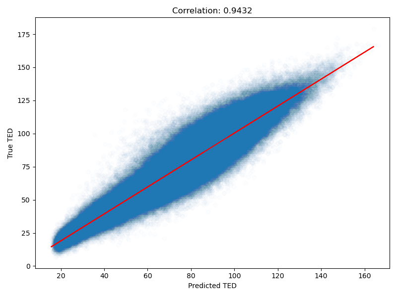

# predTED

Fast approximate prediction of pairwise **Tree Edit Distances (TED)** for RNA secondary structures in dot-bracket notation. Uses 144 structural features with a LightGBM regression model to avoid the expensive exact O(n^4) computation.

**Up to 100x faster** than `RNAdistance` for pairwise distance matrices, with multi-threaded computation and SIMD acceleration. Designed for large-scale RNA structure comparisons with 100K+ structures.

| Metric | Value |
|--------|-------|
| R^2 | 0.927 |
| MAE | 4.9 |
| Pearson r | 0.963 |



## Installation

### From PyPI (recommended)

```bash
pip install predted
```

This automatically compiles a C extension for ~28x faster feature computation. Falls back to pure Python if compilation fails.

**Requirements:** Python >= 3.9, numpy, lightgbm

### From source

```bash
git clone https://github.com/syseitz/predTED.git
cd predTED
pip install .
```

### C command-line tool

For high-throughput batch processing on clusters (multi-threaded, SIMD-accelerated):

```bash
# Build the CLI binary (requires LightGBM C library + OpenMP)
make cli
```

On macOS, the Makefile auto-detects LightGBM from the Python package and OpenMP from Homebrew (`brew install libomp`). On Linux, LightGBM must be available via `pkg-config`.

## Usage

### Python

```python
import predted

# Single pair prediction
ted = predted.predict("((..))", "(())..")
print(ted)  # 20

# Raw float prediction (before rounding)
ted_float = predted.predict_float("((..))", "(())..")
print(ted_float)  # 19.6176

# Pairwise distance matrix
structures = ["((..))", "(())..", "...((..)).."]
matrix = predted.predict_matrix(structures)
print(matrix)
# [[ 0 20 22]
#  [20  0 21]
#  [22 21  0]]

# Float matrix
matrix_f = predted.predict_matrix(structures, dtype=float)
```

### C command-line tool

Reads dot-bracket structures from stdin (one per line), outputs the pairwise distance matrix:

```bash
echo -e "((..))\n(())..\n...((..)).." | bin/predted
```

Options:

```
--threads, -t N        Set number of threads (default: auto)
--upper-only, -u       Output only upper triangle (j > i)
--float, -f            Output float values instead of integers
--binary, -b           Output raw binary bytes instead of text
--topk K, -k K         KNN mode: keep only K closest neighbours per row
--tau T, -T T          Distance threshold for KNN (default: 300)
--knn-prefix P, -K P   File prefix for KNN output (.idx + .dst memmaps)
--max-len-diff L, -L L Skip pairs differing by >L in length (prefilter)
--subsample S, -s S    Predict only ~1/S pairs (deterministic subsampling)
```

## How it works

For each RNA structure, 36 features are extracted from the dot-bracket notation:

- **Structural counts:** internal loops, multiloops, bulges, hairpin loops, stacked pairs
- **Depth statistics:** mean/variance of nesting depth (overall, paired, unpaired), peaks
- **Stem properties:** count, max/mean/variance of stem length
- **Loop properties:** mean/variance of loop size, max loop size
- **Size features:** structure length, paired/unpaired base counts
- **Base pair distances:** mean and max
- **Hairpin/internal loop sizes:** mean and max
- **Bigram frequencies:** 8 dinucleotide pattern frequencies from {(, ), .}
- **Graph properties:** centrality, tree depth

For each pair of structures, these 36 base features are combined into **144 pairwise features** (|diff|, sum, min, max), which are fed into a LightGBM regression model to predict the TED.

## Project structure

```
predted/              Python package
  __init__.py           API: predict(), predict_float(), predict_matrix()
  features.py           Feature computation (C extension with Python fallback)
c_src/                C source code
  predted_features.c    Feature computation (single source of truth, StructureContext)
  predted_features.h    Header (StructureContext typedef, feature functions)
  _features_module.c    Python C extension wrapper
  predTED.c             CLI binary (multi-threaded, SIMD, chunk-based parallelism)
  model.h               Embedded model for CLI (generated from model.txt)
model.txt             LightGBM model file
data/                 Training data
  structures.txt        1500 RNA structures
  ted_matrix.txt        Ground truth TED matrix
weights/              Training scripts and evaluation results
benchmarks/           Speed benchmarks and batch-size tuning
```

## Training your own model

```bash
# Generate training data (requires ViennaRNA)
cd data && python generate_train_data.py

# Train with rich features (144)
python train_rich_model.py

# Regenerate C header for CLI
xxd -i model.txt c_src/model.h
```

## Performance

### Multi-threading (CLI)

The CLI uses OpenMP for chunk-based parallel computation. Each thread gets its own LightGBM booster instance for lock-free prediction. Measured on 1500 structures (M4 Mac, 1.1M pairs):

| Threads | Time | Speedup |
|---------|------|---------|
| 1 | 11.8s | 1.0x |
| 2 | 6.2s | 1.9x |
| 4 | 3.4s | 3.5x |
| 8 | 2.2s | 5.4x |

On SLURM clusters with 32+ cores, expect near-linear scaling.

### vs RNAdistance

| N | Pairs | predted (1 thread) | RNAdistance | Speedup |
|---|-------|--------------------|-------------|---------|
| 50 | 1,225 | 0.01s | 0.6s | 60x |
| 100 | 4,950 | 0.03s | 2.4s | 80x |
| 500 | 124,750 | 0.43s | 44.1s | 100x |

### Memory usage

The CLI streams results in chunks (`ROW_CHUNK`, default 256 rows), keeping RAM bounded:

| N structures | Feature array | Chunk buffer | Total |
|-------------|---------------|--------------|-------|
| 10,000 | 2.7 MB | 5 MB | ~10 MB |
| 100,000 | 27 MB | 49 MB | ~80 MB |
| 500,000 | 137 MB | 244 MB | ~400 MB |

The Python API uses row-by-row streaming with NumPy vectorisation (O(N) memory per row).

## Running tests

```bash
pip install .[dev]
make cli       # optional, for CLI tests
make test
```

## Batch-size tuning

The CLI processes LightGBM predictions in batches (default 8192). To find the optimal batch size for your system:

```bash
make bench-batch
```

Override at compile time: `make cli CFLAGS="-O2 -march=native -DBATCH_SIZE=16384"`

## Licence

This project is licensed under the MIT Licence. See the [LICENSE](LICENSE) file for details.

## Contact

For questions or issues, please open an issue on the [GitHub repository](https://github.com/syseitz/predTED).
